# 💬 고독한채팅방 : 실시간 채팅 서비스

> Spring Boot와 Kafka를 공부하며 진행한 개인 프로젝트입니다. 사용자는 채팅방을 검색하고, 채팅방에 들어가 다른 사용자와 이미지 전송을 포함한 실시간 채팅을 나눌 수 있으며, 새로운 채팅에 대한 알림을
> 받을 수 있습니다. Thymeleaf를 사용하여 프론트엔드를 구현하였으며, 무한 스크롤 동작을 구현하기 위해 QueryDSL을 사용하였습니다. 또, Amazon S3 서비스를 연동하여 이미지를 저장하도록
> 하였습니다.

## 🔍 About 고독한채팅방

👤 개인 프로젝트

📅 2025.06.06 - In progress

🔍 [상세 노션 페이지](https://www.notion.so/chloeeekim/2176e927bee080f999b0fabb9926b913)

## 🛠️ 사용 기술 및 라이브러리

- JAVA `17`
- Spring Boot `3.4.5`, Spring Security `6.4.5`, Thymeleaf `3.5.0`
- Spring Data JPA `3.4.5`, QueryDSL `5.0.0`
- H2 `2.3.232`, Amazon S3 (Spring Cloud AWS `2.2.6.RELEASE`)
- Apache Kafka (Broker `3.9.1`), Spring Kafka Client `3.3.6`

## 👩‍💻 구현 내용

1. **사용자 인증 및 권한 관리 (Spring Security + Session)**
    - 회원가입, 로그인, 로그아웃 기능 구현
    - 세션 기반 인증 시스템 구축
    - Spring Security 필터 커스터마이징으로 요청별 인증 처리
    - `BCryptPasswordEncoder`를 사용하여 비밀번호를 암호화하여 DB에 저장

2. **Kafka + WebSocket 기반 실시간 채팅 서비스 구현**
    - Apache Kafka와 WebSocket을 활용하여 실시간 채팅 메시지 송수신 기능 구현
    - 메시지에 메타데이터(chatRoomId 등)를 포함시켜 메시지 라우팅 처리
    - `KafkaTemplate`을 이용해 서버가 메시지를 Kafka에 발행(Publish), `@KafkaListener`를 이용해 메시지 구독(Subscribe)
    - 메시지의 타입(시스템 메시지, 텍스트 메시지, 이미지 등)을 명확히 구분하여 처리
    - Kafka 메시지를 JSON 형태로 직렬화/역직렬화하여 데이터 일관성 유지
    - 수신된 메시지는 WebSocket 세션을 통해 실시간으로 해당 사용자에게 전달
    - 채팅 메시지는 DB에 저장하여 재접속 시 이전 메시지 히스토리 조회 가능

3. **Kafka + WebSocket 기반 알림(Notification) 시스템 구현**
    - Kafka의 토픽을 채팅 메시지용 토픽과 알림 전용 토픽으로 분리하여 구독 처리
    - 사용자가 속한 채팅방에 새로운 메시지가 도착하면, 해당 유저에게 알림용 메시지를 Notification 토픽에 발행
    - 알림 메시지는 별도로 분리된 Kafka Consumer에서 처리되어, DB에 저장
    - Notification 페이지에서는 수신된 알림 리스트를 최신순으로 조회 가능하며, 사용자가 읽었는지 여부도 함께 표시
    - 새로운 알림 도착 시 실시간으로 해당 사용자에게 전달

4. **QueryDSL 기반 무한 스크롤 기능 구현**
    - 채팅방 목록, 채팅 메시지, 알림 목록 등에서 무한 스크롤 방식의 데이터 로딩 기능 구현
    - 기존 offset 기반 페이징의 성능 개선을 위해 QueryDSL + No-Offset 방식 적용
    - 정렬 기준이 되는 필드(`createdAt`, `id` 등)를 기준으로 커서 이후의 데이터만 조회
    - JSON 응답에 `hasNext` 플래그를 포함하여 불필요한 추가 API 호출이 없도록 구현

5. **Thymeleaf 기반 서버 사이드 렌더링(SSR) 프론트엔드 구현**
    - HTML 템플릿 엔진 Thymeleaf를 사용하여 사용자 화면을 서버 사이드에서 동적으로 렌더링
    - 로그인/회원가입, 채팅방, 알림 페이지 등 전체 사용자 화면을 Thymeleaf 템플릿으로 구현
    - 서버에서 전달한 모델 객체를 기반으로 동적 컨텐츠 출력
    - 채팅방 리스트, 채팅방 메시지, 알림 리스트 등은 무한 스크롤 방식의 데이터 로딩 구현
    - 공통 레이아웃과 fragment 구조를 활용하여 유지보수성과 재사용성 확보

6. **Amazon S3를 이용한 이미지 업로드 기능 구현**
    - 사용자 프로필 이미지, 채팅방 메시지 등 다양한 이미지 파일을 AWS S3 버킷에 저장하여 관리
    - MultipartFile 형태로 전달된 파일을 S3에 업로드하고, 접근 가능한 URL을 생성하여 DB에 저장
    - 업로드 시 파일명 중복 방지를 위해 UUID 기반의 고유 파일명 생성 스키마 재정의

## 💾 ERD

## 💻 UI 및 기능 구현 화면

- 로그인 / 회원가입 화면
    - 로그인 및 회원가입 기능이 구현되어 있으며, 입력값이 유효하지 않은 경우 적절한 에러 메시지가 출력됩니다.
      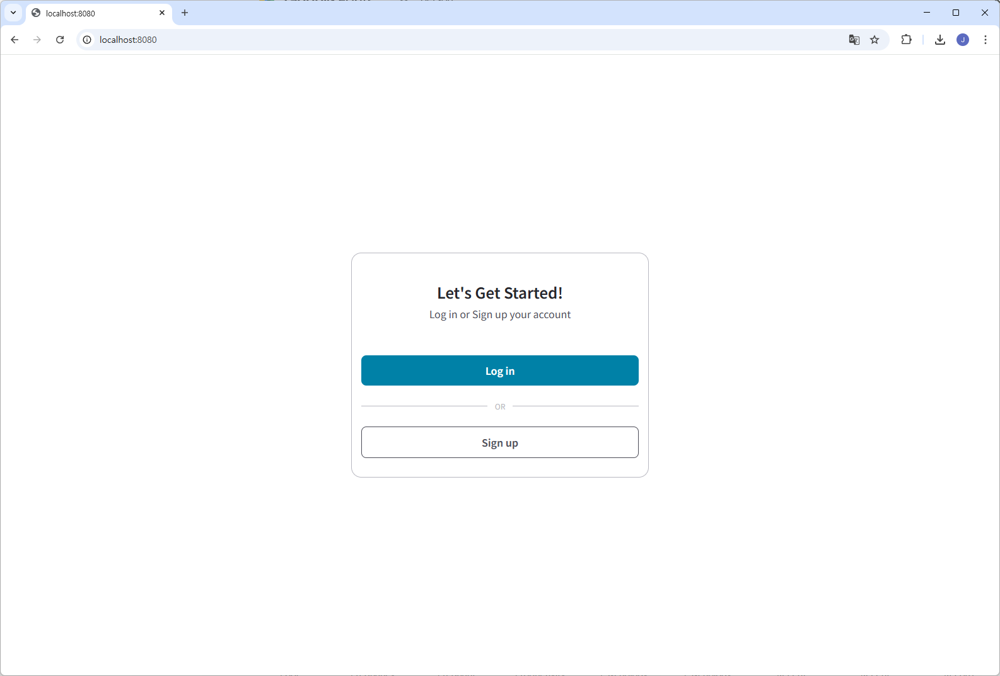
      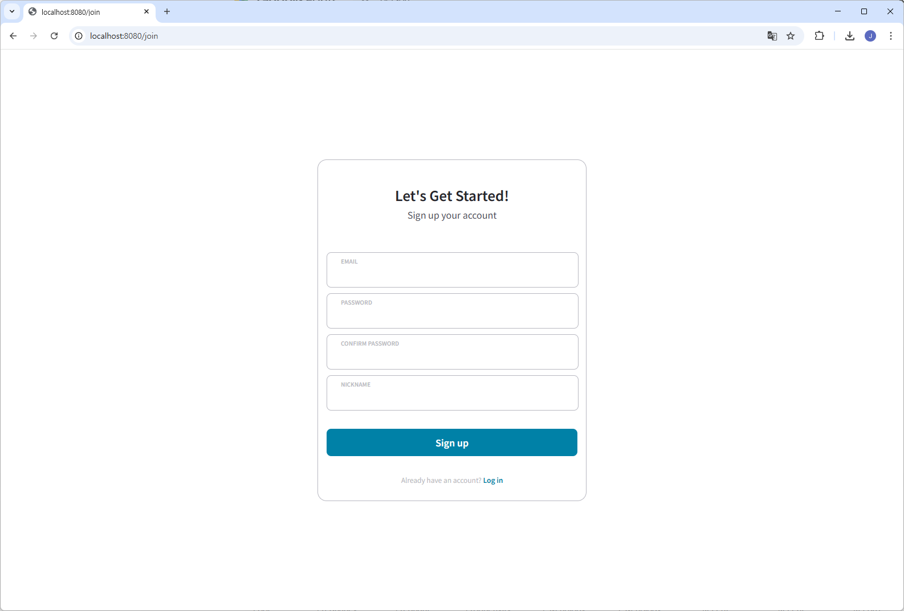
      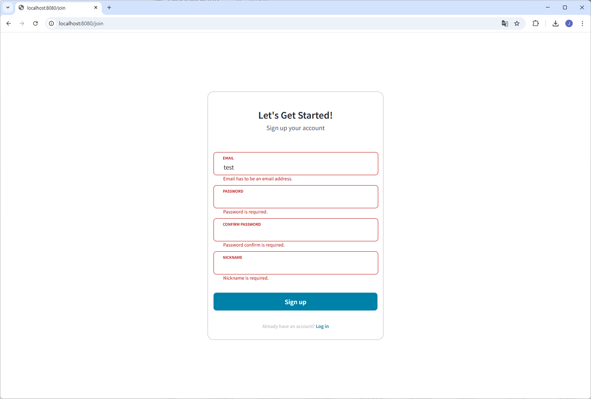
      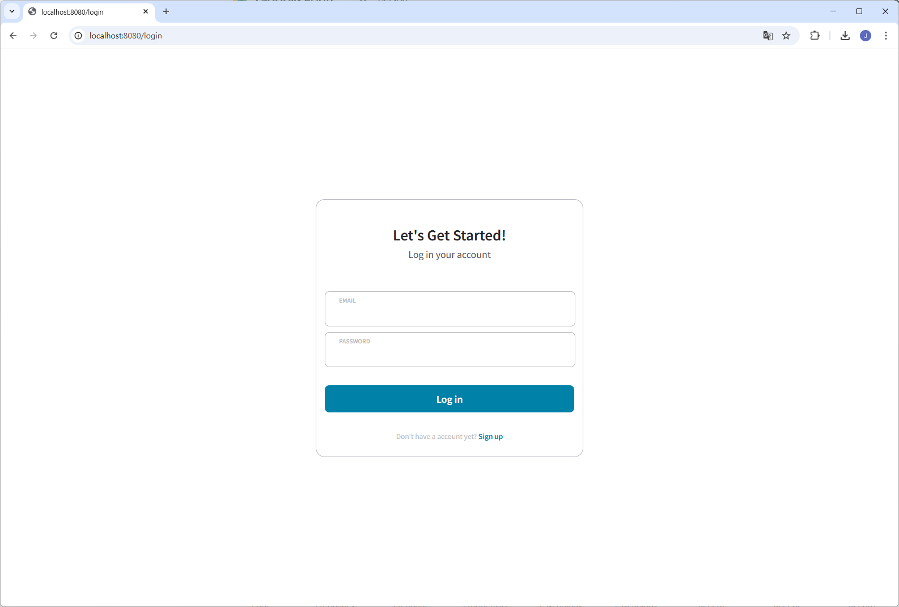
      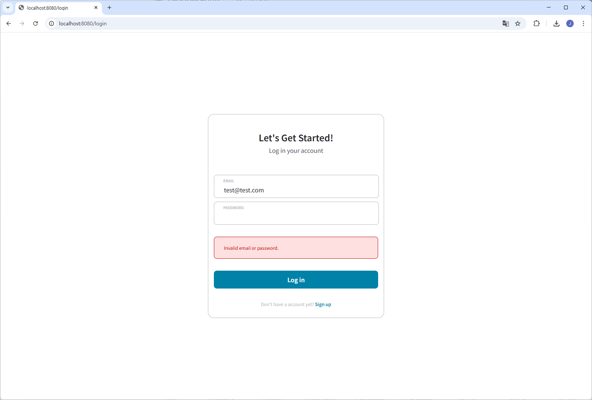
- 채팅방 리스트 화면
    - 채팅방 리스트를 확인할 수 있으며, 조인 가능한 경우 Join 버튼이, 조인되어 있는 채팅방의 경우 Open 버튼이 표시됩니다. 상단 서치바를 통해 키워드로 채팅방 리스트를 조회할 수 있습니다. 채팅방
      리스트는 무한 스크롤 방식으로 동작하며, 스크롤이 하단에 위치하면 자동으로 추가 데이터 로딩이 이루어집니다.
      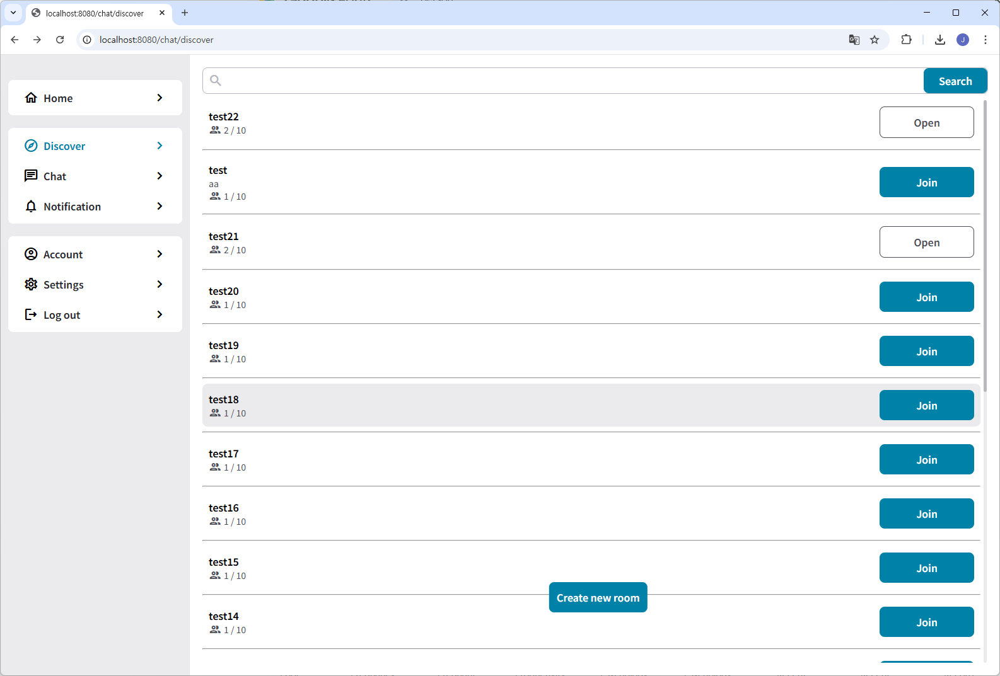
      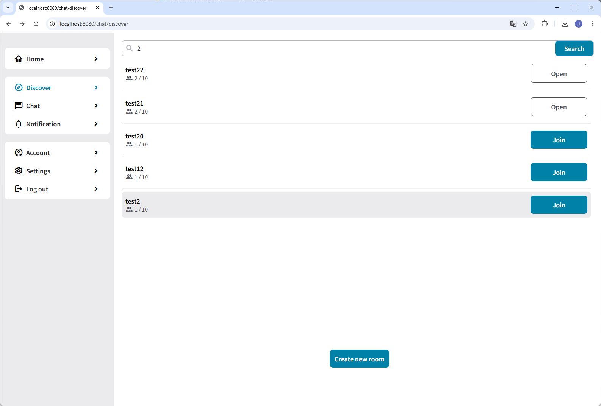
- 실시간 채팅
    - 다른 사용자들과 채팅방에서 실시간으로 채팅이 가능합니다. 채팅방이 만들어지거나 사용자가 채팅방에 들어오는 등의 경우 시스템 메시지가 표시되며, 이미지도 전송 가능합니다. 채팅 메시지는 무한 스크롤 방식으로
      동작하며, 스크롤이 상단에 위치하면 자동으로 추가 데이터 로딩이 이루어집니다.
      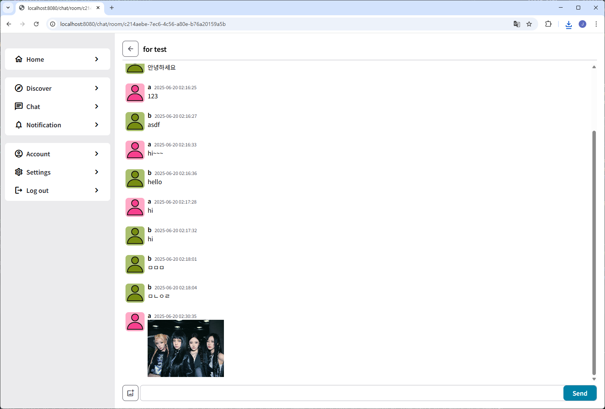
      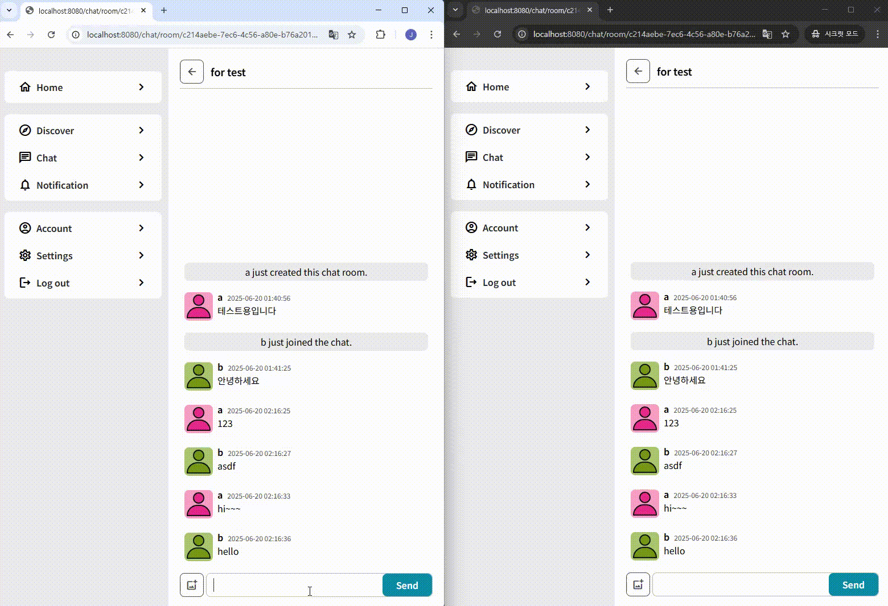
- 실시간 알림
    - 사용자가 속한 채팅방에 새로운 메시지가 존재하는 경우, 알림 목록에서 확인할 수 있습니다. 알림 또한 실시간으로 목록에 추가되어 확인할 수 있으며, 무한 스크롤 방식으로 동작하여 스크롤이 하단에 위치하면
      자동으로 추가 데이터 로딩이 이루어집니다.
      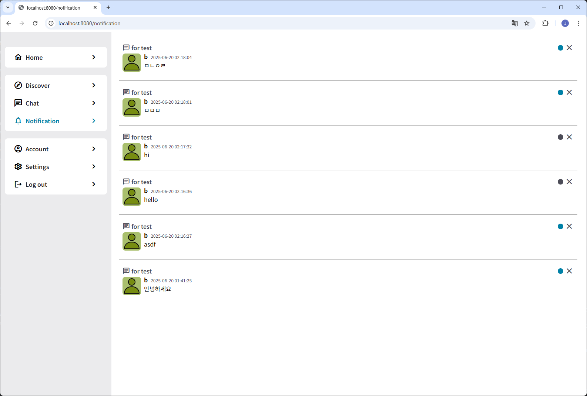
      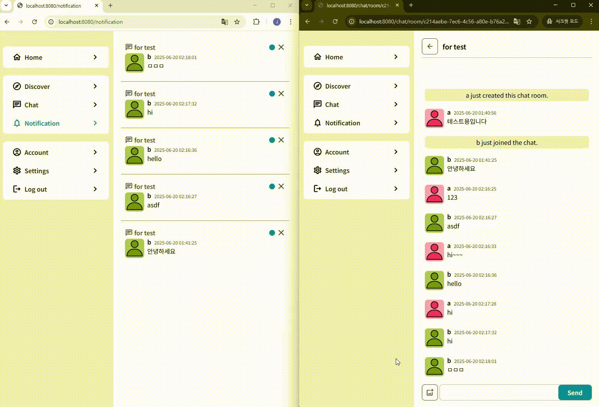
